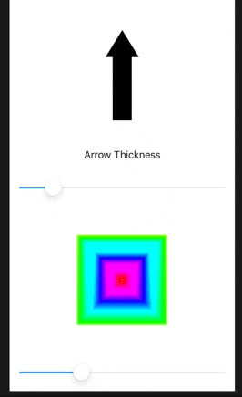
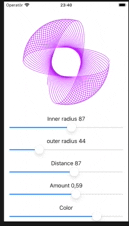

# Drawing
Different drawing techniques







## Day43-Day46

### Custom path

Path
`.move, .addLine`

### Shape
```swift
struct Arc: Shape {
    .... 
    func path(in rect: CGRect) -> Path {
        ....
    }
}
```

### InsettableShape protocol
This is a shape that can be inset – reduced inwards – by a certain amount to produce another shape. 

with conform to this, a `Shape` can apply `.strokeBorder()`

### CGAffineTransform
Describes how a path or view should be rotated, scaled, or sheared

### Even-Odd Fills
How overlapping shapes should be rendered
` .fill(Color.red, style: FillStyle(eoFill: true))`

### ImagePaint
Wraps images in a way that we have complete control over how they should be rendered, which in turn means we can use them for borders and fills without problem.

For example,

```swift
  View
    .border(ImagePaint(image: ...)
```
This will make border with pattern of image


### drawingGroup()
Render the contents of the view into an off-screen image before putting it back onto the screen as a single rendered output.
This is much faster when it is a multi-combined views

### ColorMultiply

```swift
VIew
   .colorMultiply(.red)
   ```

multiplies each source pixel color with the destination pixel colo
Using multiply with a solid color applies a really common tint effect: blacks stay black (because they have the color value of 0, so regardless of what you put on top multiplying by 0 will produce 0), whereas lighter colors become various shades of the tint.


### animatableData

When a @State property change,  <\br>
1) SwiftUI is examining the state of our view before the binding changes, <\br>
2) examining the target state of our views after the binding changes,  <\br>
3) then applying an animation to get from point A to point B. <\br>

Thus, when we Tap,

```swift
    struct ContentView: View {
        @State private var insetAmount: CGFloat = 50
            var body: some View {
            Trapezoid(insetAmount: insetAmount)
                .frame(width: 200, height: 100)
                .onTapGesture {
                        withAnimation {
                        self.insetAmount = CGFloat.random(in: 10...90)
                    }
            }
        }
    }

```
`insetAmount` get updated,  Trapezoid redraw the view, thus there is no animation effect.

In depth, althoguh `insetAmount` is changing immedicately ( 2) ), SwiftUI continue monitor the changing value over time as part of animation(3).  SwiftUI keep setting  ` animatableData` to the latest value between old and new value.  Thus 

with ` animatableData` below, the animation would work
```swift
    var animatableData: CGFloat {
        get { insetAmount }
        set { self.insetAmount = newValue }
    }
```


If there are more than one @State property updated under ` withAnimation`
`AnimatablePair` can be used.

