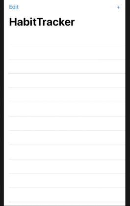
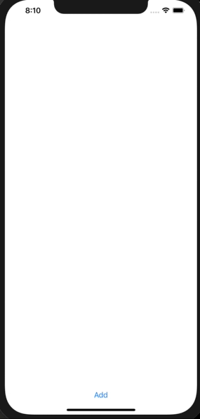

# Welcome to the 100DaysOfSwiftUI 

#### [Unit Converter (Day19_ChallengeDay)](https://www.hackingwithswift.com/100/swiftui/19)  [(Code)](https://github.com/EpiGardenia/100DaysOfSwiftUI/tree/master/Day19_ChallengeDay)

#### [Guess The Flag (Day20_22_Proj2)](https://www.hackingwithswift.com/100/swiftui/23)  [(Code)](https://github.com/EpiGardenia/100DaysOfSwiftUI/tree/master/Day20_Day22_Proj2)

#### Day23_Day24_Proj3
### [PaperScissorsRock (Milestone1)](https://www.hackingwithswift.com/guide/ios-swiftui/2/3/challenge) [(Code)](https://github.com/EpiGardenia/100DaysOfSwiftUI/tree/master/Day25_Milestone1)

#### [Better Rest (Day28 Challenge)](https://www.hackingwithswift.com/books/ios-swiftui/betterrest-wrap-up) [(Code)](https://github.com/EpiGardenia/100DaysOfSwiftUI/tree/master/Day26_Day28_Proj4)

#### [Word Scramble  (Day31 Challenge)](https://www.hackingwithswift.com/books/ios-swiftui/word-scramble-wrap-up)  [(Code)](https://github.com/EpiGardenia/100DaysOfSwiftUI/tree/master/Day29_Day31_Proj5)

#### [Animation (Day32_Day34_Proj6)](https://www.hackingwithswift.com/100/swiftui/32) [(Code)](https://github.com/EpiGardenia/100DaysOfSwiftUI/tree/master/Day32_Day34_Proj6)

### [Edutainment (Milestone2)](https://www.hackingwithswift.com/guide/ios-swiftui/3/3/challenge) [(Code)](https://github.com/EpiGardenia/100DaysOfSwiftUI/tree/master/Day35_Milestone2)

#### [iExpense (Day36_38_Proj7)](https://www.hackingwithswift.com/100/swiftui/36) [(Code)](https://github.com/EpiGardenia/100DaysOfSwiftUI/tree/master/Day36_38_Proj7)

#### [Moonshot (Day39_Day42_Proj8)](https://www.hackingwithswift.com/100/swiftui/39)
#### [Drawing (Day43_Day46_Proj9)](https://www.hackingwithswift.com/100/swiftui/43) [(Code)](https://github.com/EpiGardenia/100DaysOfSwiftUI/tree/master/Day43_Day46_Proj9)
### [Habit Tracker (Milestone3)](https://www.hackingwithswift.com/guide/ios-swiftui/4/3/challenge) [(Code)](https://github.com/EpiGardenia/100DaysOfSwiftUI/tree/master/Day47_Day48_Milestone3)

#### [Cupcake(Day52 Challenge)](https://www.hackingwithswift.com/100/swiftui/49) [(Code)](https://github.com/EpiGardenia/100DaysOfSwiftUI/tree/master/Day49_Day52_Proj10)

#### [Bookworm(Day56 challenge)](https://www.hackingwithswift.com/books/ios-swiftui/bookworm-wrap-up) [(Code)](https://github.com/EpiGardenia/100DaysOfSwiftUI/tree/master/Day53_Day56_Proj11)

#### [CoreData (Day59 challenge)](https://www.hackingwithswift.com/books/ios-swiftui/core-data-wrap-up) [(Code)](https://github.com/EpiGardenia/100DaysOfSwiftUI/tree/master/Day57_Day59_Proj12)

### [FriendFace (Milestone4)](https://www.hackingwithswift.com/guide/ios-swiftui/5/3/challenge) [(Code)](https://github.com/EpiGardenia/100DaysOfSwiftUI/tree/master/Day60_Day61_Milestone4)

#### [Instafilter (Day67 challenge)](https://www.hackingwithswift.com/books/ios-swiftui/instafilter-wrap-up) [(Code)](https://github.com/EpiGardenia/100DaysOfSwiftUI/tree/master/Day62_Day67_Proj13)

#### [BucketList (Day73 challenge)](https://www.hackingwithswift.com/books/ios-swiftui/bucket-list-wrap-up) [(Code)](https://github.com/EpiGardenia/100DaysOfSwiftUI/tree/master/Day68_Day73_Proj14)

#### Accessibility (Day74_Day76_Proj15) [(Code)](https://github.com/EpiGardenia/100DaysOfSwiftUI/tree/master/Day74_Day76_Proj15)
### [IRemember (Milestone5)](https://www.hackingwithswift.com/guide/ios-swiftui/6/3/challenge) [(Code)](https://github.com/EpiGardenia/100DaysOfSwiftUI/tree/master/Day77_Day78_Milestone5)

#### [HotProspect (Day85 challenge)](https://www.hackingwithswift.com/books/ios-swiftui/hot-prospects-wrap-up) [(Code)](https://github.com/EpiGardenia/100DaysOfSwiftUI/tree/master/Day79_Day85_Proj16)

#### [FlashZilla (Day86_Day91_Proj17)] [(Code)](https://github.com/EpiGardenia/100DaysOfSwiftUI/tree/master/Day86_Day91_Proj17)
#### [Day94 Challenge](https://www.hackingwithswift.com/books/ios-swiftui/layout-and-geometry-wrap-up)

### [DiceGame (Milestone6)](https://www.hackingwithswift.com/guide/ios-swiftui/7/3/challenge) [(Code)](https://github.com/EpiGardenia/100DaysOfSwiftUI/tree/master/Day95_Milestone6_Dice)

#### [SnowSeeker (Day99 challenge)](https://www.hackingwithswift.com/books/ios-swiftui/snowseeker-wrap-up) [(Code)](https://github.com/EpiGardenia/100DaysOfSwiftUI/tree/master/Day96_Day99_Proj19)

